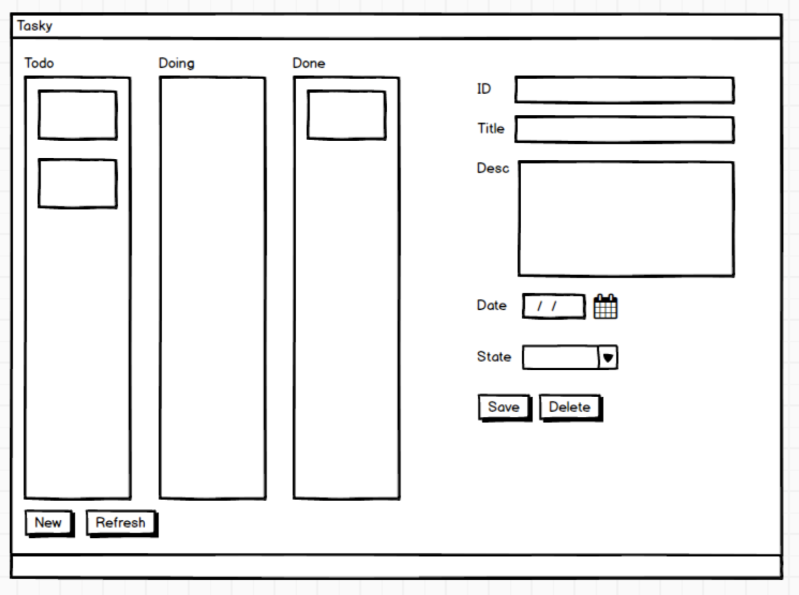

# Übung 6 – Tasky Part 4
In dieser Übung schrieben wir das Tasky GUI (Graphical User Interface). Richten Sie sich nach dem nachfolgenden Mockup. Das UI erlaubt noch keine Interaktion (Events). Es enthält vorerst einmal nur Layouts und Controls.

**Bemerkung zur späteren Funktionsweise:** In einer Task steht die ID und der Titel. Durch das Anwählen der Task erscheinen auf der rechten Seite (Detail View) dann die Details zur Task.

## Vorgehen

1. Überlegen Sie sich welches Layout Sie wählen. Wahrscheinlich braucht es verschachtelte Layouts. Machen Sie sich eine Zeichnung und bestimmen Sie geeignete "innere" Layouts.

2. Bestimmen Sie die Controls, die Sie verwenden wollen. Platzieren Sie diese Controls auf den Layouts. Wichtig: **Das UI muss nicht resizable sein.**

3. Platzieren Sie Platzhalter für die Tasks in die zugehörigen Container (Todo, Doing, Done). Welcher Control-Typ würde sich dazu eignen?
